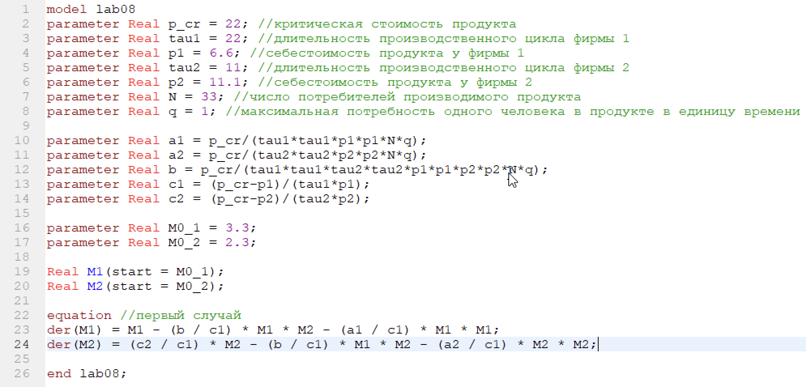
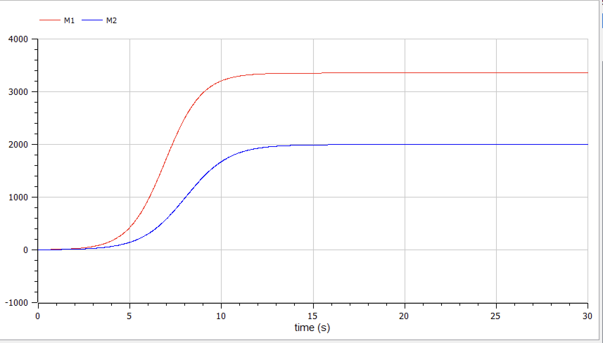
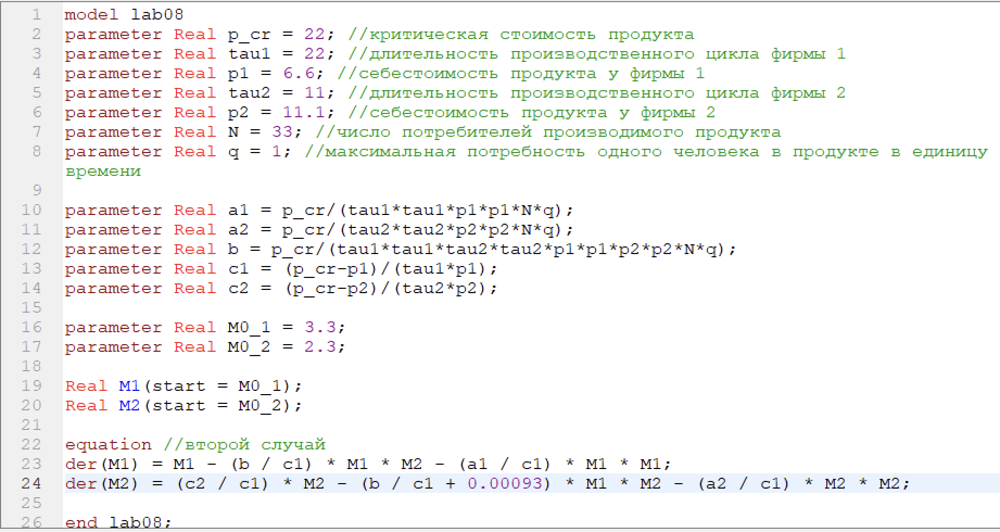
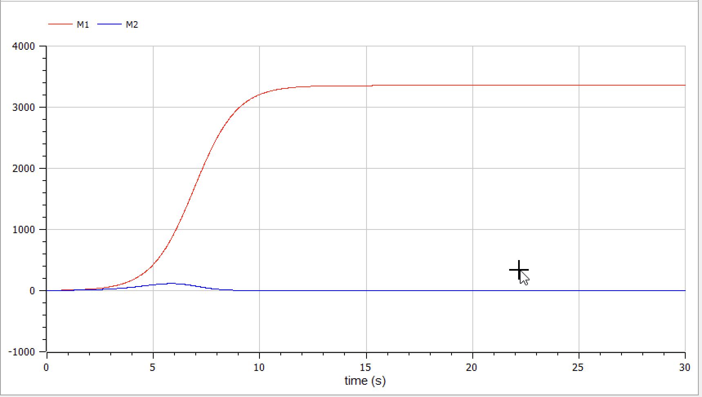

---
# Front matter
title: "Отчёт по лабораторной работе №8"  
subtitle: "Вариант 39"  
author: "Александр Олегович Воробьев"

# Generic otions
lang: ru-RU
toc-title: "Содержание"

# Pdf output format
toc: true # Table of contents
toc_depth: 2
lof: true # List of figures
lot: true # List of tables
fontsize: 12pt
linestretch: 1.5
papersize: a4
documentclass: scrreprt
## I18n
polyglossia-lang:
  name: russian
  options:
	- spelling=modern
	- babelshorthands=true
polyglossia-otherlangs:
  name: english
### Fonts
mainfont: PT Serif
romanfont: PT Serif
sansfont: PT Sans
monofont: PT Mono
mainfontoptions: Ligatures=TeX
romanfontoptions: Ligatures=TeX
sansfontoptions: Ligatures=TeX,Scale=MatchLowercase
monofontoptions: Scale=MatchLowercase,Scale=0.9
## Biblatex
biblatex: true
biblio-style: "gost-numeric"
biblatexoptions:
  - parentracker=true
  - backend=biber
  - hyperref=auto
  - language=auto
  - autolang=other*
  - citestyle=gost-numeric
## Misc options
indent: true
header-includes:
  - \linepenalty=10 # the penalty added to the badness of each line within a paragraph (no associated penalty node) Increasing the value makes tex try to have fewer lines in the paragraph.
  - \interlinepenalty=0 # value of the penalty (node) added after each line of a paragraph.
  - \hyphenpenalty=50 # the penalty for line breaking at an automatically inserted hyphen
  - \exhyphenpenalty=50 # the penalty for line breaking at an explicit hyphen
  - \binoppenalty=700 # the penalty for breaking a line at a binary operator
  - \relpenalty=500 # the penalty for breaking a line at a relation
  - \clubpenalty=150 # extra penalty for breaking after first line of a paragraph
  - \widowpenalty=150 # extra penalty for breaking before last line of a paragraph
  - \displaywidowpenalty=50 # extra penalty for breaking before last line before a display math
  - \brokenpenalty=100 # extra penalty for page breaking after a hyphenated line
  - \predisplaypenalty=10000 # penalty for breaking before a display
  - \postdisplaypenalty=0 # penalty for breaking after a display
  - \floatingpenalty = 20000 # penalty for splitting an insertion (can only be split footnote in standard LaTeX)
  - \raggedbottom # or \flushbottom
  - \usepackage{float} # keep figures where there are in the text
  - \floatplacement{figure}{H} # keep figures where there are in the text
---

# Цель работы  

  Изучить модель конкуренции двух фирм, построить графики моделей для двух случаев: с учётом социально-психологических факторов и без.  

# Задание  

  Построить график динамики изменения объемов продаж фирмы 1 и фирмы 2 для первого случая, которая описывается следующей системой уравнений:  

  $\frac{d M_1}{d \theta} = M_1 - \frac{b}{c_1} M_1 M_2 - \frac{a_1}{c_1} M_1^2$  
  $\frac{d M_2}{d \theta} = \frac{c_2}{c_1}M_2 - \frac{b}{c_1} M_1 M_2 - \frac{a_2}{c_1} M_2^2$  

  Система для второго случая, где учитываются социально-психологические факторы:  

  $\frac{d M_1}{d \theta} = M_1 - \frac{b}{c_1} M_1 M_2 - \frac{a_1}{c_1} M_1^2$  
  $\frac{d M_2}{d \theta} = \frac{c_2}{c_1}M_2 - (\frac{b}{c_1} + 0,00093) M_1 M_2 - \frac{a_2}{c_1} M_2^2$  

  В обоих случаях задача рассматривается со следующими начальными условиями и параметрами:  
  $M_0^1 = 3.3, M_0^2 = 2.3,$  
  $p_{cr} = 22, N = 33, q = 1$  
  $\tau_1 = 22, \tau_2 = 11,$
  $\tilde{p_1} = 6.6, \tilde{p_2} = 11.1$  

# Теоретическое введение  

  Для построения модели конкуренции хотя бы двух фирм необходимо рассмотреть модель одной фирмы. Вначале рассмотрим модель фирмы, производящей продукт долговременного пользования, когда цена его определяется балансом спроса и предложения. Примем, что этот продукт занимает определенную нишу рынка и конкуренты в ней отсутствуют.
  Обозначим:  
  $N$ – число потребителей производимого продукта.  
  $S$ – доходы потребителей данного продукта. Считаем, что доходы всех потребителей одинаковы. Это предположение справедливо, если речь идет об одной рыночной нише, т.е. производимый продукт ориентирован на определенный слой населения.  
  $M$ – оборотные средства предприятия  
  $\tau$ – длительность производственного цикла  
  $p$ – рыночная цена товара  
  $\tilde{p}$ – себестоимость продукта, то есть переменные издержки на производство единицы продукции.  
  $\delta$ – доля оборотных средств, идущая на покрытие переменных издержек.  
  $\kappa$ – постоянные издержки, которые не зависят от количества выпускаемой продукции.  
  $Q(S/p)$ – функция спроса, зависящая от отношения дохода S к цене p. Она равна количеству продукта, потребляемого одним потребителем в единицу времени.  
  Функцию спроса товаров долговременного представляют в простейшей форме:  
  $$Q = q - k \frac{p}{S} = q(1 - \frac{p}{p_{cr}}),$$
  где $q$ – максимальная потребность одного человека в продукте в единицу времени.
  Эта функция падает с ростом цены и при $p = p_{cr}$ (критическая стоимость продукта) потребители отказываются от приобретения товара. Величина $p_{cr} = S(q/k)$. Параметр $k$ – мера эластичности функции спроса по цене. Таким образом, функция спроса в форме является пороговой (то есть, $Q(S/p) = 0$ при $p ≥ p_{cr}$) и обладает свойствами насыщения.  

# Выполнение лабораторной работы

**1. Пропишем программу для построения графика модели первого случая.** 

  Зададим исходные переменные и пропишем уравнение:

  { #fig:001 width=70% }  

  Запускаем модель для времени $0 < t < 30$, с шагом 0,01:

  { #fig:002 width=70% }  

  { #fig:003 width=70% }   

**2. Изменим программу для второго случая, заменив коэффициент перед вторым уравнением.**  

	Изменим уравнение:  

  { #fig:004 width=70% }  

	Запускаем модель для второго случая с теми же установками симуляции:  
    
  { #fig:005 width=70% }  
 
# Выводы

В ходе выполнения лабораторной работы я познакомился с моделью конкуренции двух фирм, релизовал графики для двух случаев: модель с учетом экономического фактора влияния и модель, где дополнительно учитываются социально-психологические факторы - формирование общественного предпочтения одного товара другому, не зависимо от их качества и цены.

# Список литературы{.unnumbered}

	1. Кулябов Д.С. Лабораторная работа №8. Модель конкуренции двух фирм [Электронный ресурс] - 7 с. 
	2. Кулябов Д.С. Лабораторная работа №8. Варианты [Электронный ресурс] - 106 с. 

::: {#refs}
:::
